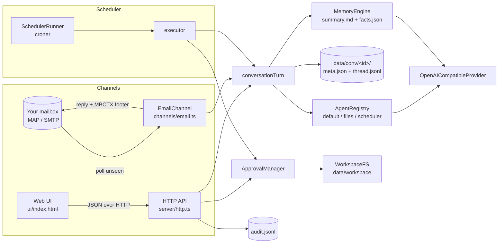

# EveryBot

**English** | [简体中文](README.zh-CN.md)

[](https://github.com/HamsterPark/EveryBot/actions/workflows/ci.yml)
[](LICENSE)
[](package.json)
[](tsconfig.json)

A small, self-hosted AI assistant you can talk to through a web UI or plain email, with sandboxed file tools, approval-gated writes, file-based memory and cron scheduling.

It runs as one Node.js process on your own machine, keeps every conversation in plain files under `data/`, and talks to any OpenAI-compatible chat endpoint (SiliconFlow, OpenAI, DeepSeek, a local Ollama or vLLM server). No framework, no database, no cloud account beyond the LLM key.


## Features

- **Two channels, one brain.** Chat in the browser, or send yourself an email and get the answer back in the same mail thread. Both go through the same conversation pipeline and share memory.
- **Email threading without server state.** Every reply carries a one-line `MBCTX` footer; quoting it in your next mail is all it takes to continue the conversation. See [Email channel](#email-channel-and-the-mbctx-protocol).
- **Sandboxed file tools.** Reads and listings are confined to `data/workspace` (no absolute paths, no `..`, no symlinks or junctions anywhere in the path). Writes and deletes are queued and only run after you approve them, and every tool call is written to an audit log.
- **File-based memory.** Each conversation keeps a rolling markdown summary and a JSON facts object next to its transcript. With an LLM they are maintained automatically; without one, raw turns are appended.
- **Cron scheduling.** Tasks in `data/tasks.json` can send mail, run a file tool or hold a recurring chat. Definitions are validated before they are saved, changes apply without a restart, file writes still need approval and mail can only go to allow-listed recipients.
- **Any OpenAI-compatible model,** with per-request timeouts and retries that only retry what can succeed (network errors, 429, 5xx).
- **Small and inspectable.** About 2.5k lines of strict TypeScript on Node's built-in `http` module, 95 tests, CI on Node 20/22/24.

## Architecture



| Module                         | Responsibility                                                                            |
| ------------------------------ | ----------------------------------------------------------------------------------------- |
| `src/server/http.ts`           | Zero-dependency HTTP API and static UI; input validation, body size cap, opt-in CORS      |
| `src/channels/email.ts`        | IMAP polling, sender allow-list, MBCTX threading, SMTP replies, reconnect and retry logic |
| `src/core/conversationTurn.ts` | The one place a user message becomes a reply: context → agent → persist → memory          |
| `src/core/agents.ts`           | Agent registry; three prompt-only agents (`default`, `files`, `scheduler`)                |
| `src/core/llmProvider.ts`      | OpenAI-compatible chat client with timeouts and selective retries                         |
| `src/core/workspaceFs.ts`      | The file sandbox                                                                          |
| `src/memory/`                  | Rolling summary + facts per conversation                                                  |
| `src/scheduler/`               | Task persistence, validation, croner runner and the guarded executor                      |
| `src/tools/`                   | File tool wrappers, approval queue, audit log                                             |
| `src/conversation/`            | Conversation store, id validation, processed-mail dedupe                                  |

## Quick start

Requires Node.js 20 or newer (`.nvmrc` pins 24).

```bash
git clone https://github.com/HamsterPark/EveryBot.git
cd EveryBot
npm install
cp .env.example .env        # Windows: copy .env.example .env
```

Edit `.env` and set at least `LLM_API_KEY` (and `LLM_BASE_URL` if you are not using SiliconFlow). Then:

```bash
npm run dev                 # development: runs src/ directly via tsx
# or
npm run build && npm start  # production: compiled JavaScript in dist/
```

Open <http://127.0.0.1:3000>. The mail channel stays disabled until `MAIL_USER` and `MAIL_PASS` are set.

## Configuration

All settings come from environment variables; `.env` is loaded automatically at startup. See [`.env.example`](.env.example) for a commented template.

| Variable                                     | Default                          | Purpose                                                                                                        |
| -------------------------------------------- | -------------------------------- | -------------------------------------------------------------------------------------------------------------- |
| `DATA_DIR`                                   | `./data`                         | Conversations, workspace, tasks and logs live here                                                             |
| `HOST` / `PORT`                              | `127.0.0.1` / `3000`             | Where the HTTP server listens. Keep the loopback default unless you know why (see [Security](#security-model)) |
| `ALLOWED_ORIGIN`                             | _(empty)_                        | Exact origin allowed to call the API from another web page. Empty disables CORS entirely                       |
| `LLM_BASE_URL`                               | `https://api.siliconflow.com/v1` | Any OpenAI-compatible `/chat/completions` base URL (`SILICONFLOW_BASE_URL` still works)                        |
| `LLM_API_KEY`                                | _(empty)_                        | Bearer token for that endpoint (`SILICONFLOW_API_KEY` still works)                                             |
| `LLM_TIMEOUT_MS`                             | `60000`                          | Per-attempt timeout; timeouts, 429 and 5xx are retried with backoff                                            |
| `MODEL_DEFAULT`                              | `deepseek-ai/DeepSeek-V3`        | Model for the default agent, and the fallback for the ones below                                               |
| `MODEL_FILES`, `MODEL_SCHEDULER`             | `MODEL_DEFAULT`                  | Models for the `files` and `scheduler` agents                                                                  |
| `MODEL_MEMORY_SUMMARY`, `MODEL_MEMORY_FACTS` | `MODEL_DEFAULT`                  | Models used to maintain memory (a cheap model is fine here)                                                    |
| `MAIL_USER` / `MAIL_PASS`                    | _(empty)_                        | Mailbox login (for QQ Mail: the IMAP/SMTP authorization code, not the account password). Empty = mail off      |
| `IMAP_HOST`, `IMAP_PORT`, `IMAP_SECURE`      | `imap.qq.com`, `993`, `true`     | Incoming mail                                                                                                  |
| `SMTP_HOST`, `SMTP_PORT`, `SMTP_SECURE`      | `smtp.qq.com`, `465`, `true`     | Outgoing mail                                                                                                  |
| `MAIL_ALLOWED_SENDERS`                       | _(empty)_                        | Comma-separated senders whose mail is answered. Empty = only mail from `MAIL_USER` itself                      |
| `MAIL_ALLOWED_RECIPIENTS`                    | _(empty)_                        | Addresses scheduled `sendMessage` tasks may mail. Empty = only `MAIL_USER`                                     |
| `POLL_INTERVAL_MS`                           | `15000`                          | How often the inbox is polled                                                                                  |
| `DEFAULT_AGENT`                              | `default`                        | Agent used when none is requested                                                                              |

## Email channel and the MBCTX protocol

The mail channel turns an ordinary mailbox into a chat transport. You email your own address (or the bot's address from an allow-listed sender), and the answer comes back in the same thread.

```mermaid
sequenceDiagram
  participant You as You (any mail client)
  participant Box as Mailbox (IMAP/SMTP)
  participant Bot as EveryBot
  participant LLM as LLM
  You->>Box: Subject "@files what is in my workspace?"
  Bot->>Box: search unseen (every POLL_INTERVAL_MS)
  Box-->>Bot: envelope
  Note over Bot: sender allow-listed? otherwise leave the mail untouched
  Box-->>Bot: full message
  Note over Bot: newest MBCTX footer in the body → conversation id, or start a new one
  Bot->>LLM: system prompt + summary + facts + recent turns + your message
  LLM-->>Bot: reply
  Note over Bot: store both turns, mark the mail processed, update memory
  Bot->>Box: "#2 [files] what is in my workspace?" + MBCTX footer
  Box-->>You: lands in the same thread (In-Reply-To / References)
```

Every reply ends with a footer like this:

```text
---
MBCTX v1 | c=AB12CD34EF | m=2 | a=files | t=2026-09-02T09:14:10.000Z
```

- `c` is the conversation id, `m` the reply number, `a` the agent that answered, `t` the timestamp.
- When you reply, your mail client quotes the footer. The bot scans the whole body and picks the footer with the highest `m`, so nested quotes and forwarded threads still resolve to the right conversation. No footer means a fresh conversation.
- Put `@files` or `@scheduler` at the start of the subject to pick an agent for that conversation; an unknown name keeps the current agent.
- Outgoing mail is tagged `X-EveryBot-Out: 1` so the bot never answers itself, and each inbound `Message-ID` is recorded in `data/inbox_processed.jsonl` so a message is handled at most once, even across restarts.
- The message counts as processed as soon as the reply is stored. If SMTP fails, the reply is still in the web UI and the LLM is not called again. If the LLM fails, the mail is retried on later polls and given up after three attempts.
- Mail from senders that are not allow-listed is never opened or marked read; it is your inbox, not the bot's.

## File tools and the approval flow

File tools operate on `data/workspace` only. Reads and listings run immediately; writes and deletes are queued until a human approves them.

```bash
# read-only: immediate
curl -s -X POST http://127.0.0.1:3000/api/tools/file/list \
  -H 'Content-Type: application/json' -d '{"path":"."}'
curl -s -X POST http://127.0.0.1:3000/api/tools/file/read \
  -H 'Content-Type: application/json' -d '{"path":"notes/todo.md"}'

# write or delete: queued
curl -s -X POST http://127.0.0.1:3000/api/tools/file/write \
  -H 'Content-Type: application/json' \
  -d '{"path":"notes/todo.md","content":"- renew the domain before Friday\n"}'
# → {"pendingId":"420fb80d-…","message":"Approval required"}

curl -s http://127.0.0.1:3000/api/approvals                       # what is waiting
curl -s -X POST http://127.0.0.1:3000/api/approvals/420fb80d-…/approve   # or …/reject
```

The web UI shows the same queue with Approve / Reject buttons. Every call, pending or executed, is appended to `data/audit.jsonl`.

The sandbox (`src/core/workspaceFs.ts`) rejects absolute, drive-relative (`C:foo`) and UNC paths, anything that resolves outside the workspace, and any symlink or junction along the path, including the target itself, so a planted link cannot redirect a write. The workspace root cannot be deleted. Request bodies are capped at 1 MB.

## Scheduler

Tasks are stored in `data/tasks.json` and run by [croner](https://github.com/Hexagon/croner). Three action types exist:

| `action.type` | Fields                                       | What happens                                                                                                  |
| ------------- | -------------------------------------------- | ------------------------------------------------------------------------------------------------------------- |
| `runChat`     | `promptTemplate`                             | Sends the prompt to the default agent in a stable conversation named `task-<id>`, so runs build on each other |
| `runTool`     | `toolName`, `args`                           | `file.list` / `file.read` run directly; `file.write` / `file.delete` are queued for approval                  |
| `sendMessage` | `channel: "mail"`, `textTemplate`, `target?` | Mails the text to `target` (must be `MAIL_USER` or in `MAIL_ALLOWED_RECIPIENTS`)                              |

```bash
curl -s -X POST http://127.0.0.1:3000/api/tasks -H 'Content-Type: application/json' -d '{
  "id": "daily-digest",
  "cron": "0 9 * * 1-5",
  "timezone": "Asia/Shanghai",
  "action": { "type": "runChat", "promptTemplate": "Summarize what I should focus on today in three bullets." }
}'
curl -s http://127.0.0.1:3000/api/tasks                      # list
curl -s -X POST http://127.0.0.1:3000/api/tasks/daily-digest/run   # run now
curl -s -X DELETE http://127.0.0.1:3000/api/tasks/daily-digest
```

The cron expression, timezone, action type and tool name are validated before anything is saved (bad input is a `400`, a duplicate id a `409`), the live schedule is reloaded on every change, a task whose cron fails to parse is logged and skipped instead of crashing startup, and overlapping runs of the same task are prevented. Results go to `data/runs.jsonl`.

## API

| Method   | Path                         | Body / query                                 | Notes                                 |
| -------- | ---------------------------- | -------------------------------------------- | ------------------------------------- |
| `GET`    | `/health`                    |                                              |                                       |
| `GET`    | `/api/sessions`              |                                              | Conversations, newest first           |
| `POST`   | `/api/chat`                  | `{ sessionId?, message, agentId? }`          | Returns `{ sessionId, reply, msgNo }` |
| `GET`    | `/api/thread?sessionId=…`    |                                              | Last 50 turns                         |
| `POST`   | `/api/tools/file/list`       | `{ path? }`                                  | Immediate                             |
| `POST`   | `/api/tools/file/read`       | `{ path, maxBytes? }`                        | Immediate                             |
| `POST`   | `/api/tools/file/write`      | `{ path, content }`                          | Returns `pendingId`                   |
| `POST`   | `/api/tools/file/delete`     | `{ path }`                                   | Returns `pendingId`                   |
| `GET`    | `/api/approvals`             |                                              |                                       |
| `POST`   | `/api/approvals/:id/approve` |                                              | Executes the queued call              |
| `POST`   | `/api/approvals/:id/reject`  |                                              |                                       |
| `GET`    | `/api/tasks`                 |                                              |                                       |
| `POST`   | `/api/tasks`                 | `{ id?, cron, timezone?, action, enabled? }` | `201`, validated                      |
| `POST`   | `/api/tasks/:id/run`         |                                              | Run outside the schedule              |
| `DELETE` | `/api/tasks/:id`             |                                              |                                       |

Ids (`sessionId`, task ids) must match `^[A-Za-z0-9_-]{1,64}$`; anything else is a `400`.

## Security model

EveryBot is a personal tool that assumes a trusted machine. Read this before changing the defaults.

- **No authentication.** Anyone who can reach the port can read the workspace, approve queued writes and create tasks. That is why the server binds to `127.0.0.1` by default. Do **not** put it on `0.0.0.0` or behind a public port; if you need remote access, use an SSH tunnel or a reverse proxy that authenticates.
- **CORS is off unless you opt in.** Without `ALLOWED_ORIGIN` no CORS headers are sent, so a random web page open in your browser cannot script the API. Setting it to an exact origin allows only that origin.
- **The sender allow-list is a filter, not authentication.** `From` headers can be spoofed. It stops strangers and newsletters from consuming your LLM budget; it does not prove who wrote a mail. Prompt injection through mail is possible, which is one reason file writes always go through approval.
- **Approval is the real boundary for side effects.** Nothing modifies the workspace, from the web, from mail, or from the scheduler, until a human approves it. Scheduled mail can only go to allow-listed recipients.
- **What is validated:** conversation and task ids (path-safe character set), request body size (1 MB, enforced while streaming), cron expressions, action types and tool names, file paths (see the sandbox rules above).
- **Secrets** live only in `.env` (git-ignored). Keys are sent as a bearer token to `LLM_BASE_URL` and nowhere else.

## Data layout

```text
data/
├── conv/<convId>/
│   ├── meta.json           agent, next message number, timestamps
│   ├── thread.jsonl        one JSON line per turn
│   ├── summary.md          rolling memory summary
│   └── facts.json          extracted facts
├── workspace/              the only directory file tools can touch
├── tasks.json              scheduled tasks
├── runs.jsonl              scheduler run log
├── audit.jsonl             every file-tool call
└── inbox_processed.jsonl   handled mail (Message-ID dedupe)
```

JSON state files are written atomically (temp file + rename), so a crash never leaves a half-written `tasks.json` or `meta.json`.

## Development

```bash
npm run dev            # run from source with tsx
npm run typecheck      # tsc --noEmit
npm run lint           # eslint
npm run format         # prettier --write .
npm run format:check
npm test               # vitest
npm run check          # typecheck + lint + format:check + test (what CI runs)
npm run build          # compile to dist/
```

Tests use an in-memory IMAP/SMTP fake, an injected `fetch` for the LLM client and temporary directories for the stores, so `npm test` needs no network, no mailbox and no API key. CI runs the full check on Node 20, 22 and 24.

```text
src/
├── index.ts               wiring and startup
├── config.ts              environment → typed config
├── channels/email.ts      mail channel
├── conversation/          store, ids, processed-mail dedupe
├── core/                  agents, LLM client, sandbox, MBCTX, conversation turn, helpers
├── memory/                summary + facts
├── scheduler/             engine, validation, runner, executor
├── server/http.ts         HTTP API
└── tools/                 file tools, approvals, audit
ui/index.html              the web UI (vanilla JS, no build step)
```

## License

[MIT](LICENSE) © 2026 Yuanhao Lyu (HamsterPark)
