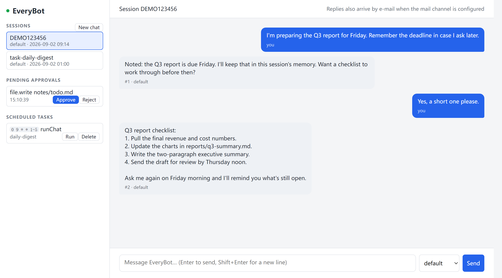
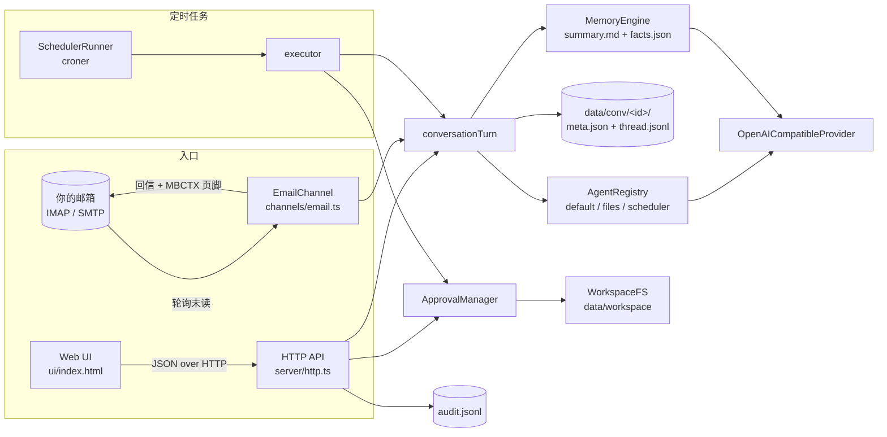

# EveryBot

[English](README.md) | **简体中文**

[](https://github.com/HamsterPark/EveryBot/actions/workflows/ci.yml)
[](LICENSE)
[](package.json)
[](tsconfig.json)

一个小巧、可自托管的 AI 助手：既能在网页里聊，也能直接用普通邮件对话；带沙箱化的文件工具、需要人工审批的写操作、基于文件的记忆，以及 cron 定时任务。

它是一个运行在你自己机器上的 Node.js 进程，所有会话都以纯文件形式保存在 `data/` 下，可以对接任何 OpenAI 兼容的对话接口（硅基流动、OpenAI、DeepSeek，或本地的 Ollama / vLLM）。没有框架、没有数据库，除了一个 LLM 的 key 之外不依赖任何云服务。



## 功能

- **两个入口，一个大脑。** 在浏览器里聊天，或者给自己的邮箱发一封邮件，回复会回到同一个邮件线程。两条路径走同一套对话流水线，共享记忆。
- **不依赖服务端状态的邮件多轮对话。** 每封回信末尾带一行 `MBCTX` 页脚，回信时引用它即可延续会话。见[邮件通道](#邮件通道与-mbctx-协议)。
- **沙箱化的文件工具。** 读取和列目录被限制在 `data/workspace`（禁止绝对路径、`..`、路径中任何位置的符号链接和 junction）。写入和删除先进入队列，只有你批准后才会执行；每次工具调用都写入审计日志。
- **基于文件的记忆。** 每个会话在转录旁边维护一份滚动的 Markdown 摘要和一个 JSON 事实对象。有 LLM 时自动维护；没有时追加原始对话。
- **cron 定时任务。** `data/tasks.json` 中的任务可以发邮件、运行文件工具或进行周期性对话。任务定义保存前经过校验，改动无需重启即可生效，文件写入仍需审批，邮件只能发给白名单收件人。
- **任意 OpenAI 兼容模型，** 每次请求有超时，只重试值得重试的失败（网络错误、429、5xx）。
- **小而透明。** 约 2500 行严格模式 TypeScript，基于 Node 内置 `http` 模块，95 个测试，CI 覆盖 Node 20/22/24。

## 架构



| 模块                           | 职责                                                                      |
| ------------------------------ | ------------------------------------------------------------------------- |
| `src/server/http.ts`           | 零依赖的 HTTP API 与静态页面；入参校验、请求体上限、按需开启的 CORS       |
| `src/channels/email.ts`        | IMAP 轮询、发件人白名单、MBCTX 线程、SMTP 回信、重连与重试                |
| `src/core/conversationTurn.ts` | 用户消息变成回复的唯一路径：上下文 → agent → 持久化 → 记忆                |
| `src/core/agents.ts`           | agent 注册表；三个仅提示词不同的 agent（`default`、`files`、`scheduler`） |
| `src/core/llmProvider.ts`      | OpenAI 兼容的对话客户端，带超时与选择性重试                               |
| `src/core/workspaceFs.ts`      | 文件沙箱                                                                  |
| `src/memory/`                  | 每个会话的滚动摘要 + 事实                                                 |
| `src/scheduler/`               | 任务持久化、校验、croner 运行器与带护栏的执行器                           |
| `src/tools/`                   | 文件工具封装、审批队列、审计日志                                          |
| `src/conversation/`            | 会话存储、id 校验、已处理邮件去重                                         |

## 快速开始

需要 Node.js 20 或更高（`.nvmrc` 指定 24）。

```bash
git clone https://github.com/HamsterPark/EveryBot.git
cd EveryBot
npm install
cp .env.example .env        # Windows: copy .env.example .env
```

编辑 `.env`，至少填写 `LLM_API_KEY`（不用硅基流动的话再改 `LLM_BASE_URL`），然后：

```bash
npm run dev                 # 开发：用 tsx 直接运行 src/
# 或
npm run build && npm start  # 生产：运行 dist/ 中编译好的 JavaScript
```

打开 <http://127.0.0.1:3000>。在设置 `MAIL_USER` 和 `MAIL_PASS` 之前，邮件通道保持关闭。

## 配置

所有设置都来自环境变量，启动时会自动加载 `.env`。带注释的模板见 [`.env.example`](.env.example)。

| 变量                                         | 默认值                           | 作用                                                                           |
| -------------------------------------------- | -------------------------------- | ------------------------------------------------------------------------------ |
| `DATA_DIR`                                   | `./data`                         | 会话、工作区、任务和日志的存放目录                                             |
| `HOST` / `PORT`                              | `127.0.0.1` / `3000`             | HTTP 服务监听地址。除非清楚后果，否则保持只监听本机（见[安全模型](#安全模型)） |
| `ALLOWED_ORIGIN`                             | _(空)_                           | 允许跨域调用 API 的唯一来源。留空则完全不发 CORS 头                            |
| `LLM_BASE_URL`                               | `https://api.siliconflow.com/v1` | 任意 OpenAI 兼容的 `/chat/completions` 基地址（`SILICONFLOW_BASE_URL` 仍可用） |
| `LLM_API_KEY`                                | _(空)_                           | 该接口的 Bearer token（`SILICONFLOW_API_KEY` 仍可用）                          |
| `LLM_TIMEOUT_MS`                             | `60000`                          | 单次尝试的超时；超时、429、5xx 会退避重试                                      |
| `MODEL_DEFAULT`                              | `deepseek-ai/DeepSeek-V3`        | 默认 agent 的模型，也是下面几项的回退值                                        |
| `MODEL_FILES`、`MODEL_SCHEDULER`             | `MODEL_DEFAULT`                  | `files` 与 `scheduler` agent 的模型                                            |
| `MODEL_MEMORY_SUMMARY`、`MODEL_MEMORY_FACTS` | `MODEL_DEFAULT`                  | 维护记忆用的模型（便宜模型即可）                                               |
| `MAIL_USER` / `MAIL_PASS`                    | _(空)_                           | 邮箱登录信息（QQ 邮箱填 IMAP/SMTP 授权码，不是账号密码）。留空则关闭邮件通道   |
| `IMAP_HOST`、`IMAP_PORT`、`IMAP_SECURE`      | `imap.qq.com`、`993`、`true`     | 收信                                                                           |
| `SMTP_HOST`、`SMTP_PORT`、`SMTP_SECURE`      | `smtp.qq.com`、`465`、`true`     | 发信                                                                           |
| `MAIL_ALLOWED_SENDERS`                       | _(空)_                           | 逗号分隔的发件人白名单。留空 = 只回复 `MAIL_USER` 自己发的邮件                 |
| `MAIL_ALLOWED_RECIPIENTS`                    | _(空)_                           | 定时任务 `sendMessage` 允许的收件人。留空 = 只能发给 `MAIL_USER`               |
| `POLL_INTERVAL_MS`                           | `15000`                          | 收件箱轮询间隔                                                                 |
| `DEFAULT_AGENT`                              | `default`                        | 未指定时使用的 agent                                                           |

## 邮件通道与 MBCTX 协议

邮件通道把一个普通邮箱变成聊天入口：你给自己的邮箱发信（或从白名单地址发给机器人邮箱），回复会回到同一线程。

```mermaid
sequenceDiagram
  participant You as 你（任意邮件客户端）
  participant Box as 邮箱（IMAP/SMTP）
  participant Bot as EveryBot
  participant LLM as LLM
  You->>Box: 主题 "@files 我的工作区里有什么？"
  Bot->>Box: 搜索未读（每 POLL_INTERVAL_MS 一次）
  Box-->>Bot: 信封
  Note over Bot: 发件人在白名单？否则原样留在收件箱
  Box-->>Bot: 完整邮件
  Note over Bot: 正文里最新的 MBCTX 页脚 → 会话 id，没有则新建
  Bot->>LLM: 系统提示 + 摘要 + 事实 + 最近轮次 + 你的消息
  LLM-->>Bot: 回复
  Note over Bot: 保存两轮、标记已处理、更新记忆
  Bot->>Box: "#2 [files] 我的工作区里有什么？" + MBCTX 页脚
  Box-->>You: 落在同一线程（In-Reply-To / References）
```

每封回信末尾都有这样的页脚：

```text
---
MBCTX v1 | c=AB12CD34EF | m=2 | a=files | t=2026-09-02T09:14:10.000Z
```

- `c` 是会话 id，`m` 是回复序号，`a` 是作答的 agent，`t` 是时间戳。
- 你回信时客户端会引用这段页脚。机器人扫描整个正文，取 `m` 最大的一条，所以多层引用和转发都能落到正确的会话；没有页脚就新建会话。
- 主题开头写 `@files` 或 `@scheduler` 可以为该会话指定 agent；未知的名字保留当前 agent。
- 发出的邮件带 `X-EveryBot-Out: 1` 头，机器人永远不会回复自己；每封来信的 `Message-ID` 记录在 `data/inbox_processed.jsonl`，重启后也不会重复处理。
- 回复一旦保存，这封邮件就算处理完毕。SMTP 失败时回复仍能在网页里看到，而且不会再调一次 LLM；LLM 失败时会在之后的轮询中重试，三次后放弃。
- 不在白名单的发件人的邮件既不会被打开也不会被标记已读：那是你的收件箱，不是机器人的。

## 文件工具与审批流

文件工具只作用于 `data/workspace`。读取和列目录立即执行；写入和删除进入队列，等人批准。

```bash
# 只读：立即执行
curl -s -X POST http://127.0.0.1:3000/api/tools/file/list \
  -H 'Content-Type: application/json' -d '{"path":"."}'
curl -s -X POST http://127.0.0.1:3000/api/tools/file/read \
  -H 'Content-Type: application/json' -d '{"path":"notes/todo.md"}'

# 写入或删除：排队
curl -s -X POST http://127.0.0.1:3000/api/tools/file/write \
  -H 'Content-Type: application/json' \
  -d '{"path":"notes/todo.md","content":"- 周五前续费域名\n"}'
# → {"pendingId":"420fb80d-…","message":"Approval required"}

curl -s http://127.0.0.1:3000/api/approvals                       # 查看队列
curl -s -X POST http://127.0.0.1:3000/api/approvals/420fb80d-…/approve   # 或 …/reject
```

网页界面里有同样的队列和批准 / 拒绝按钮。每次调用，无论待审还是已执行，都追加到 `data/audit.jsonl`。

沙箱（`src/core/workspaceFs.ts`）拒绝绝对路径、盘符相对路径（`C:foo`）和 UNC 路径、任何解析后跑到工作区外的路径，以及路径上任意位置（包括目标本身）的符号链接和 junction，所以事先放置的链接无法把写入引到别处。工作区根目录不可删除。请求体上限 1 MB。

## 定时任务

任务保存在 `data/tasks.json`，由 [croner](https://github.com/Hexagon/croner) 驱动。共有三种动作：

| `action.type` | 字段                                         | 行为                                                                          |
| ------------- | -------------------------------------------- | ----------------------------------------------------------------------------- |
| `runChat`     | `promptTemplate`                             | 把提示词发给默认 agent，固定使用名为 `task-<id>` 的会话，让每次运行有上下文   |
| `runTool`     | `toolName`、`args`                           | `file.list` / `file.read` 直接执行；`file.write` / `file.delete` 进入审批队列 |
| `sendMessage` | `channel: "mail"`、`textTemplate`、`target?` | 把文本发给 `target`（必须是 `MAIL_USER` 或在 `MAIL_ALLOWED_RECIPIENTS` 里）   |

```bash
curl -s -X POST http://127.0.0.1:3000/api/tasks -H 'Content-Type: application/json' -d '{
  "id": "daily-digest",
  "cron": "0 9 * * 1-5",
  "timezone": "Asia/Shanghai",
  "action": { "type": "runChat", "promptTemplate": "用三条要点总结我今天应该关注什么。" }
}'
curl -s http://127.0.0.1:3000/api/tasks                            # 列表
curl -s -X POST http://127.0.0.1:3000/api/tasks/daily-digest/run   # 立即运行
curl -s -X DELETE http://127.0.0.1:3000/api/tasks/daily-digest
```

cron 表达式、时区、动作类型和工具名在保存前都会校验（非法输入返回 `400`，重复 id 返回 `409`），每次改动都会重新加载调度，cron 解析失败的任务只记录日志并跳过而不会让启动崩溃，同一任务不会重叠运行。运行结果写入 `data/runs.jsonl`。

## API

| 方法     | 路径                         | 请求体 / 参数                                | 说明                               |
| -------- | ---------------------------- | -------------------------------------------- | ---------------------------------- |
| `GET`    | `/health`                    |                                              |                                    |
| `GET`    | `/api/sessions`              |                                              | 会话列表，最新在前                 |
| `POST`   | `/api/chat`                  | `{ sessionId?, message, agentId? }`          | 返回 `{ sessionId, reply, msgNo }` |
| `GET`    | `/api/thread?sessionId=…`    |                                              | 最近 50 轮                         |
| `POST`   | `/api/tools/file/list`       | `{ path? }`                                  | 立即执行                           |
| `POST`   | `/api/tools/file/read`       | `{ path, maxBytes? }`                        | 立即执行                           |
| `POST`   | `/api/tools/file/write`      | `{ path, content }`                          | 返回 `pendingId`                   |
| `POST`   | `/api/tools/file/delete`     | `{ path }`                                   | 返回 `pendingId`                   |
| `GET`    | `/api/approvals`             |                                              |                                    |
| `POST`   | `/api/approvals/:id/approve` |                                              | 执行排队的调用                     |
| `POST`   | `/api/approvals/:id/reject`  |                                              |                                    |
| `GET`    | `/api/tasks`                 |                                              |                                    |
| `POST`   | `/api/tasks`                 | `{ id?, cron, timezone?, action, enabled? }` | `201`，经过校验                    |
| `POST`   | `/api/tasks/:id/run`         |                                              | 不等调度立即运行                   |
| `DELETE` | `/api/tasks/:id`             |                                              |                                    |

id（`sessionId`、任务 id）必须匹配 `^[A-Za-z0-9_-]{1,64}$`，否则返回 `400`。

## 安全模型

EveryBot 是个人工具，假设运行在可信的机器上。改默认值之前请先读完这一节。

- **没有鉴权。** 能访问到端口的人就能读工作区、批准排队的写入、创建任务。这正是服务默认只绑定 `127.0.0.1` 的原因。**不要**把它绑到 `0.0.0.0` 或暴露到公网端口；需要远程访问时请用 SSH 隧道或带认证的反向代理。
- **CORS 默认关闭。** 不设置 `ALLOWED_ORIGIN` 就不发任何 CORS 头，浏览器里随便打开的网页无法调用这个 API；设置成某个精确的来源则只放行它。
- **发件人白名单是过滤器，不是身份认证。** `From` 头可以伪造。它能挡住陌生人和订阅邮件消耗你的 LLM 额度，但不能证明邮件是谁写的。通过邮件进行提示注入是可能的，这也是文件写入永远要走审批的原因之一。
- **审批才是副作用的真正边界。** 无论来自网页、邮件还是定时任务，任何对工作区的修改都要等人批准。定时任务发邮件只能发给白名单收件人。
- **校验范围：** 会话与任务 id（路径安全的字符集）、请求体大小（1 MB，流式读取时即生效）、cron 表达式、动作类型与工具名、文件路径（见上面的沙箱规则）。
- **密钥**只存在于 `.env`（已被 git 忽略）。key 仅作为 Bearer token 发往 `LLM_BASE_URL`，不会发到别处。

## 数据布局

```text
data/
├── conv/<convId>/
│   ├── meta.json           agent、下一条消息序号、时间戳
│   ├── thread.jsonl        每轮一行 JSON
│   ├── summary.md          滚动记忆摘要
│   └── facts.json          提取出的事实
├── workspace/              文件工具唯一能触碰的目录
├── tasks.json              定时任务
├── runs.jsonl              任务运行日志
├── audit.jsonl             每次文件工具调用
└── inbox_processed.jsonl   已处理邮件（按 Message-ID 去重）
```

JSON 状态文件都是原子写入（临时文件 + 重命名），崩溃不会留下写了一半的 `tasks.json` 或 `meta.json`。

## 开发

```bash
npm run dev            # 用 tsx 直接运行源码
npm run typecheck      # tsc --noEmit
npm run lint           # eslint
npm run format         # prettier --write .
npm run format:check
npm test               # vitest
npm run check          # typecheck + lint + format:check + test（CI 跑的就是这个）
npm run build          # 编译到 dist/
```

测试使用内存中的 IMAP/SMTP 假件、注入的 `fetch`（LLM 客户端）和临时目录（存储层），所以 `npm test` 不需要网络、邮箱或 API key。CI 在 Node 20、22、24 上跑完整检查。

```text
src/
├── index.ts               装配与启动
├── config.ts              环境变量 → 类型化配置
├── channels/email.ts      邮件通道
├── conversation/          存储、id 校验、已处理邮件去重
├── core/                  agent、LLM 客户端、沙箱、MBCTX、对话轮次、工具函数
├── memory/                摘要 + 事实
├── scheduler/             引擎、校验、运行器、执行器
├── server/http.ts         HTTP API
└── tools/                 文件工具、审批、审计
ui/index.html              网页界面（原生 JS，无构建步骤）
```

## 许可证

[MIT](LICENSE) © 2026 Yuanhao Lyu (HamsterPark)
